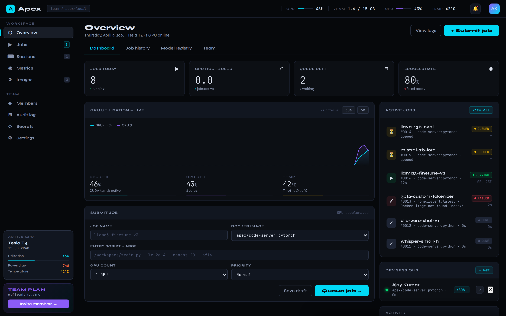
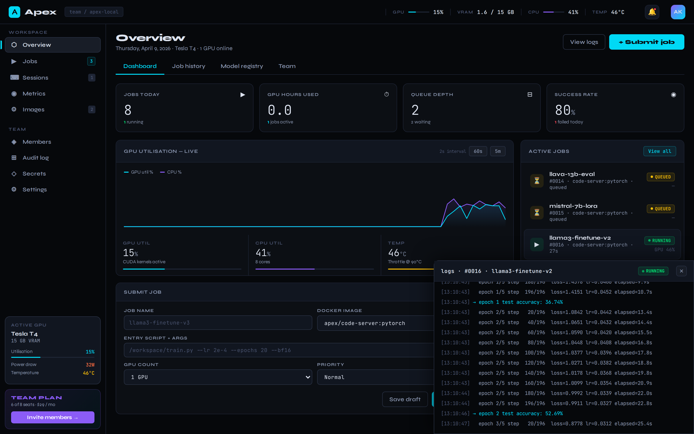
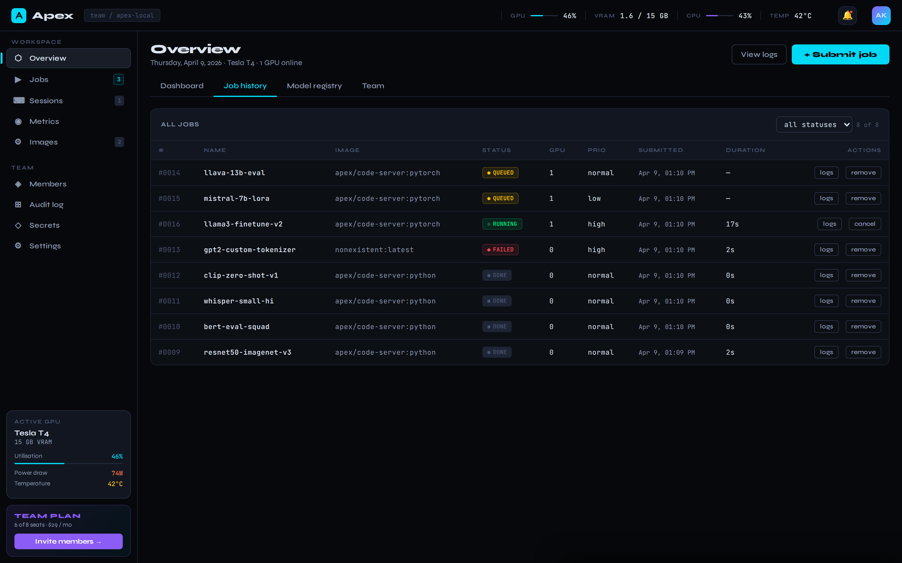
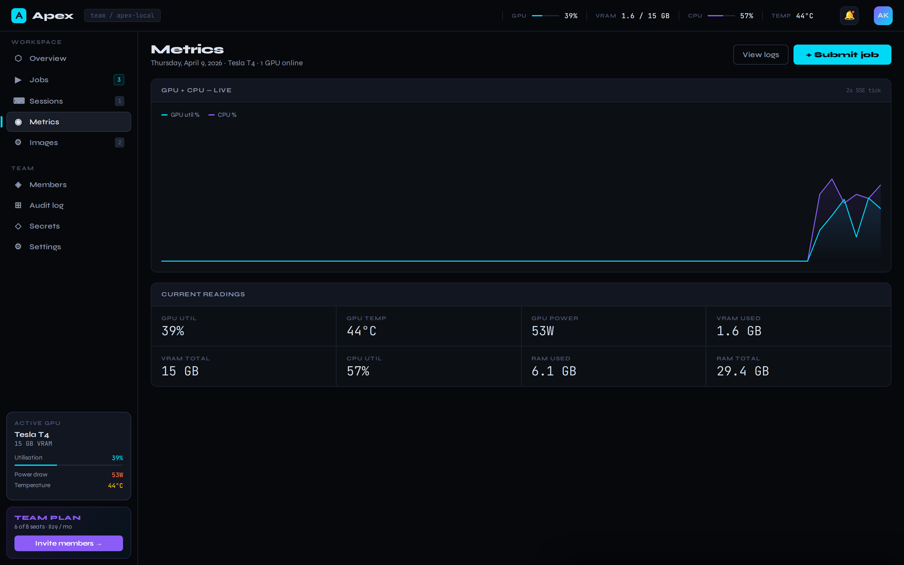
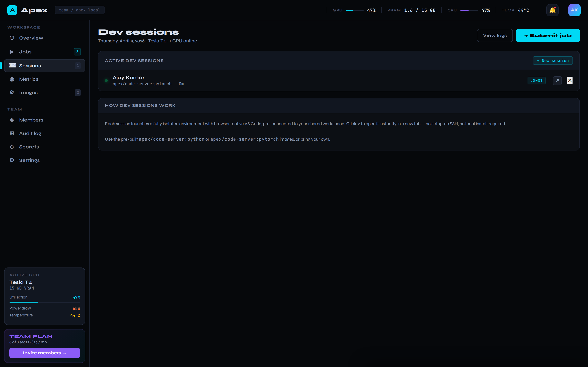
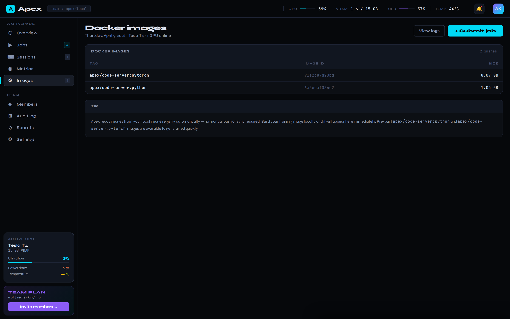

<p align="center">
  
</p>

<h1 align="center">Apex</h1>

<p align="center">
  <strong>Self-hosted ML platform for small AI teams.</strong><br/>
  Your GPU. Your team. No cloud tax.
</p>

<p align="center">
  <a href="https://tryapex.dev"></a>
  <a href="https://github.com/apexhq-dev/apex/blob/main/LICENSE"></a>
  <a href="https://pypi.org/project/apex-ml/"></a>
  <a href="https://python.org"></a>
  <a href="https://discord.gg/RFpDyhdpWJ"></a>
</p>

---

Apex is a self-hosted ML platform for teams that own their GPU. One `pip install`,
one command, your browser opens to a full job queue, live GPU monitoring, and
browser-native VS Code — all running on a single workstation.

## What you get

- **Job queue with Docker execution** — submit training jobs from the UI or API, scheduler picks them up, runs them inside Docker containers with full GPU access, streams logs back over WebSocket
- **Real-time GPU telemetry** — GPU util, VRAM, temperature, power draw, CPU, RAM, pushed to the dashboard every 2 seconds via server-sent events
- **Browser-native VS Code** — launch a `code-server` dev session in a container with your workspace pre-mounted; one click and you're coding inside the GPU
- **Job history + logs** — sortable table of every job, filter by status, tail logs from anywhere, cancel running jobs
- **Pre-built images** — `apex/code-server:python` and `apex/code-server:pytorch` (CUDA 12.4 + PyTorch 2.4) bundled as working examples
- **No Kubernetes. No cloud bill. No DevOps engineer.**

## Quickstart

```bash
pip install apex-ml
apex start
```

That's it. Your browser opens to `http://localhost:7000`.

On first run, Apex prints a one-time login to the terminal:

```
=== First-run owner account created ===
email:    owner@apex.local
password: <random>
Save this — it will not be shown again.
```

Log in with those credentials. The password is only shown once.

### Requirements

- **Python 3.10+**
- **Docker daemon** running (used to execute jobs and dev sessions)
- **NVIDIA GPU** (optional — Apex degrades gracefully to CPU-only if no GPU is present)
- **Linux or macOS** (tested on Ubuntu 22.04 + macOS 14)

### Build the base images (one-time)

```bash
apex build-images                # Python image (~2 min)
apex build-images --pytorch      # + PyTorch/CUDA image (~15 min, ~8 GB)
```

### Submit your first job

```bash
curl -X POST http://localhost:7000/api/jobs \
  -H 'Content-Type: application/json' \
  -d '{
    "name": "hello-world",
    "image": "apex/code-server:python",
    "script": "python -c \"print(\\\"hello from apex\\\")\"",
    "gpu_count": 0,
    "priority": "normal"
  }'
```

Or use the UI — click **+ Submit job** on the dashboard.

### Custom images

You can use any Docker image for training jobs:

```bash
docker build -t my-team/training-image .
# then specify my-team/training-image when submitting a job
```

For **dev sessions** (browser VS Code), the image must have `code-server` installed.
Build on top of the official base image:

```dockerfile
FROM apex/code-server:python
RUN pip install torch transformers
```

Or use `codercom/code-server:latest` directly.

### Train CIFAR-10 in 60 seconds

```bash
# Build the PyTorch image (one-time, ~8 GB)
git clone https://github.com/apexhq-dev/apex && cd apex
docker build -t apex/code-server:pytorch -f docker/pytorch.Dockerfile docker/

# Drop the training script into your workspace
cp runway-workspace/cifar10_train.py ~/apex-workspace/

# Submit the job via the UI or curl
# Image:  apex/code-server:pytorch
# Script: python /workspace/cifar10_train.py --epochs 2
# GPU:    1 GPU
```

The training job hits ~66% test accuracy on an NVIDIA L4 in about 30 seconds.

## Screenshots

<table>
  <tr>
    <td></td>
    <td></td>
  </tr>
  <tr>
    <td align="center"><b>Overview dashboard</b> — live GPU metrics, stat cards, submit form, job list, active sessions</td>
    <td align="center"><b>Live training logs</b> — WebSocket stream of real CIFAR-10 training output</td>
  </tr>
  <tr>
    <td></td>
    <td></td>
  </tr>
  <tr>
    <td align="center"><b>Job history</b> — sortable, filterable, per-row logs + cancel/remove actions</td>
    <td align="center"><b>Metrics</b> — large GPU + CPU chart with 8-cell live readings grid</td>
  </tr>
  <tr>
    <td></td>
    <td></td>
  </tr>
  <tr>
    <td align="center"><b>Dev sessions</b> — browser VS Code in one click, workspace pre-mounted</td>
    <td align="center"><b>Docker images</b> — reads directly from the host daemon, no registry push</td>
  </tr>
</table>

## The math

Compare a full month of training compute, 24/7:

| Option | Price | Math |
|---|---:|---|
| RunPod RTX 4090 | **$316 / mo** | $0.44/hr × 720 hrs |
| Lambda H100 | **$2,150 / mo** | $2.99/hr × 720 hrs |
| AWS p4d.24xlarge (8× A100) | **$23,594 / mo** | $32.77/hr × 720 hrs |
| **Your workstation + Apex** | **$29 / mo** | Team tier, 8 seats, unlimited jobs |

## Pricing

| Tier | Price | Gets you |
|---|---|---|
| **Free** | $0 forever | Full feature set, 1 seat, unlimited jobs, community support |
| **Team** | $29/mo flat | Everything in Free + 8 seats, multi-user auth, audit log, SSO, priority support |
| **Hosted** | $99/mo + GPU | We run Apex for you on a rented GPU, SLA, backups |

All tiers run the same codebase. Free and Team are self-hosted on your hardware.

## Architecture

Intentionally boring. One Python process, one pip install, one GPU machine.

```
apex/
├── cli.py                # click CLI: start, stop, status
├── config.py             # loads ~/.apex/config.json
├── docker_mgr.py         # docker SDK wrapper (create, start, clean up)
├── monitor/              # GPU (pynvml) + CPU (psutil) collector thread
├── scheduler/            # SQLite-backed queue + worker thread
├── server/               # FastAPI app + routes
│   ├── app.py            # app factory
│   ├── auth.py           # JWT + bcrypt
│   ├── db.py             # SQLite schema + connection helper
│   └── routes/           # metrics, jobs, sessions, images, users
└── static/               # Vanilla HTML/CSS/JS — no build step
```

**Stack:** FastAPI · Uvicorn · SQLite · pynvml · docker-py · SSE-Starlette · code-server · vanilla JS
**Not in the stack:** ~~React~~ ~~Redis~~ ~~Postgres~~ ~~RabbitMQ~~ ~~Kubernetes~~ ~~Helm~~ ~~Node~~ ~~webpack~~

See [`SPEC.md`](SPEC.md) for the full technical specification.

## CLI

```bash
apex start [--host 0.0.0.0] [--port 7000] [--no-browser]
apex status
apex stop              # Ctrl+C works fine, this is a stub
apex logs              # pipe `apex start` output instead
apex build-images      # build base container images (one-time)
apex config show       # print current config
apex config set KEY VALUE   # update a config value (workspace, port, host)
apex --version
```

## Configuration

Apex reads `~/.apex/config.json` on startup. Defaults:

```json
{
  "workspace_path": "~/apex-workspace",
  "port": 7000,
  "host": "0.0.0.0",
  "session_port_range": [8080, 8200],
  "jwt_secret": "<auto-generated on first run>"
}
```

View or change settings with the `apex config` command:

```bash
apex config show                          # print current config
apex config set workspace /mnt/nas/apex   # change workspace path
apex config set port 8000                 # change UI port
apex config set host 127.0.0.1           # bind to localhost only
```

Or use the `APEX_WORKSPACE` environment variable (useful for system-level config):

```bash
export APEX_WORKSPACE=/mnt/nas/apex
apex start
```

### Shared workspace (NAS / network drives)

Every job and dev session mounts the workspace directory into the container at `/workspace`. Pointing multiple team members' machines at the same network share means scripts, datasets, and checkpoints are visible to everyone without manual copying.

```bash
# 1. Mount the shared drive at the OS level (NFS example)
sudo mount -t nfs 192.168.1.10:/shared /mnt/nas

# 2. Point Apex at it
apex config set workspace /mnt/nas/apex-workspace

# 3. Restart
apex stop && apex start
```

Samba (SMB) mounts work the same way — mount it at the OS level, then run `apex config set workspace <path>`. The workspace directory is created automatically if it does not exist.

## API


| Route | Method | Description |
|---|---|---|
| `/api/health` | GET | `{"ok": true}` |
| `/api/metrics/stream` | GET (SSE) | Live GPU/CPU metrics every 2s |
| `/api/metrics/current` | GET | Single snapshot of current metrics |
| `/api/jobs` | GET | List jobs (filters: `status`, `limit`, `offset`) |
| `/api/jobs` | POST | Submit a new job |
| `/api/jobs/{id}` | GET | Job detail |
| `/api/jobs/{id}` | DELETE | Cancel running job or remove completed one |
| `/api/jobs/{id}/logs` | WS | Stream container logs line-by-line |
| `/api/sessions` | GET/POST/DELETE | List, launch, stop dev sessions |
| `/api/images` | GET | List Docker images from the host daemon |
| `/api/users/login` | POST | JWT login |
| `/api/users/me` | GET | Current user |
| `/api/users/invite` | POST | Invite a new team member (admin only) |

## Development

```bash
git clone https://github.com/apexhq-dev/apex
cd apex
pip install -e .
apex start --skip-docker-check  # dev mode without Docker
```

The frontend is plain HTML/CSS/JS in `apex/static/` — edit and refresh, no build step.

## License

[Apache License 2.0](LICENSE) © 2026 Apex contributors

## Community

- **Website** — [tryapex.dev](https://tryapex.dev)
- **Discord** — [discord.gg/RFpDyhdpWJ](https://discord.gg/RFpDyhdpWJ)
- **Twitter** — [@apexhq_dev](https://twitter.com/apexhq_dev)
- **GitHub Issues** — for bugs and feature requests
- **GitHub Discussions** — for questions and ideas
